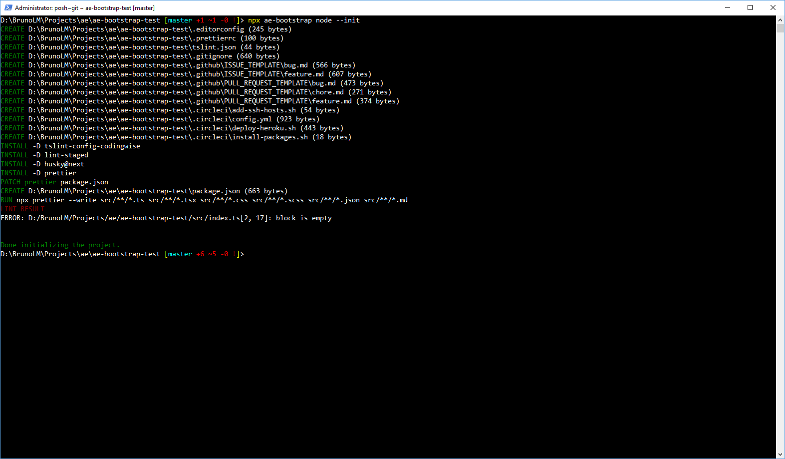
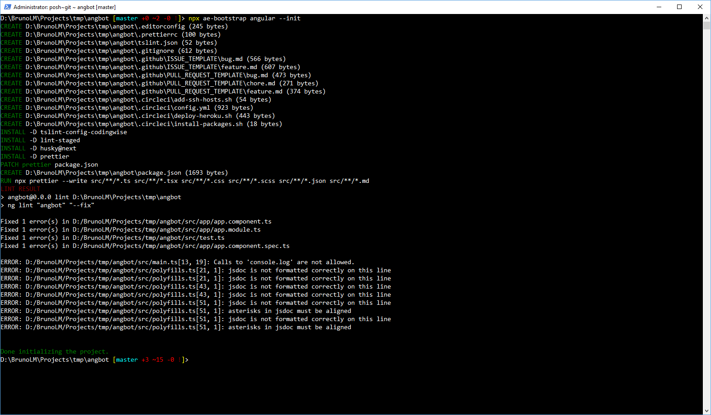
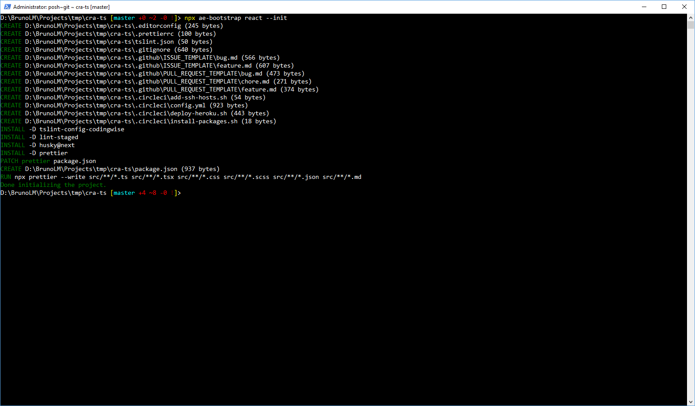

# ae-bootstrap

Adds basic configuration to Node / Angular / React projects.

## Install

```bash
npm i -D https://github.com/agencyenterprise/ae-bootstrap
```

## Usage

```bash
npx ae-bootstrap node -init
npx ae-bootstrap angular -init
npx ae-bootstrap react -init
```

## Preview

### Node

[](./screenshots/node.png)

### Angular

[](./screenshots/angular.png)

### React

[](./screenshots/react.png)
